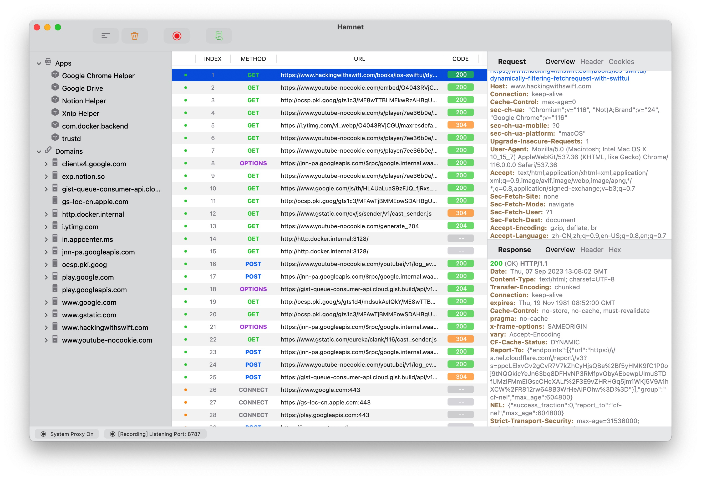

# Hamnet

> Open source Web Proxy Tool to view all the HTTP(S) & WebSocket message on Mac

  

## Screen Shot

  

## How To Build

First, Make sure you have a available apple developer account. Then, try to rename the bundle id of the Hamnet Target and the Helper. Here is a detail:

  

- Find All "com.deepread.app.hamnet" Bundle Id and replace yours **\<Bundle  ID\>**

- Find All "com.deepread.app.hamnet.privilegedHelper" and replace to " \<Bundle  ID\>.privilegedHelper"

- Project-Target-hamnet-Build Phases-Run Script, **Replace All** the Bundle ID you just use above

- Project-Target-XXXHelper-Build Phases-Run Script, **Replace All** the Bundle ID you just use above

## Need Help

You can leave an issue for free

## Contributing

Hamnet project welcomes contribution. Contributions can be made in a number of ways, a few examples are:

- Code patches via pull requests
- Documentation improvements
- Bug reports and patch reviews

## License

**CC BY-NC-SA 4.0**
